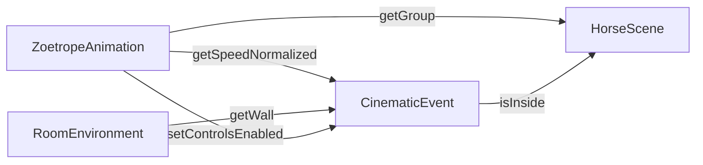

# 02 — Arquitetura do Projeto

Este documento descreve a **estrutura geral do código**, como as peças se conectam, e o fluxo de execução frame a frame.

---

## 1. Visão Geral

```
┌────────────────────────────────────────────────────────────────────┐
│                          NAVEGADOR                                  │
│                                                                    │
│  index.html → main.js → App.js (loop principal)                    │
│                                                                    │
│  ┌──────────────────────────────────────────────────────────────┐  │
│  │                     App (Orquestrador)                        │  │
│  │                                                              │  │
│  │  ┌─────────────┐  ┌──────────────┐  ┌────────────────────┐  │  │
│  │  │SceneManager │  │CameraManager │  │RendererManager     │  │  │
│  │  │(THREE.Scene)│  │(Perspective  │  │(WebGLRenderer +    │  │  │
│  │  │             │  │ Camera)      │  │ Shadow Maps)       │  │  │
│  │  └─────────────┘  └──────────────┘  └────────────────────┘  │  │
│  │                                                              │  │
│  │  ┌────────────────────────────────────────────────────────┐  │  │
│  │  │              animations[] (update loop)                 │  │  │
│  │  │                                                        │  │  │
│  │  │  ┌─────────────────┐  ┌──────────────┐  ┌──────────┐  │  │  │
│  │  │  │ZoetropeAnimation│  │CinematicEvent│  │HorseScene│  │  │  │
│  │  │  │(Sprint 1)       │  │(Sprint 2)    │  │(Sprint 3)│  │  │  │
│  │  │  └─────────────────┘  └──────────────┘  └──────────┘  │  │  │
│  │  └────────────────────────────────────────────────────────┘  │  │
│  │                                                              │  │
│  │  ┌────────────────┐  ┌──────────────────────────────────┐   │  │
│  │  │RoomEnvironment │  │ResizeHandler                     │   │  │
│  │  │(cenário)       │  │(responsividade)                  │   │  │
│  │  └────────────────┘  └──────────────────────────────────┘   │  │
│  └──────────────────────────────────────────────────────────────┘  │
└────────────────────────────────────────────────────────────────────┘
```

---

## 2. Fluxo de Inicialização

```
1. index.html carrega main.js (type="module")
2. main.js:
   - Encontra o container DOM (#canvas-container)
   - Instancia App(container)
   - Chama app.start()
3. App constructor:
   a. SceneManager → cria THREE.Scene + AmbientLight
   b. CameraManager → cria PerspectiveCamera(60°, aspect, 0.1, 1000)
      posição (8,5,6) lookAt(0,3,-2)
   c. RendererManager → cria WebGLRenderer + shadowMap PCFSoft
      adiciona canvas ao DOM
   d. ResizeHandler → listener de window resize
   e. RoomEnvironment → mesa + chão + parede + PointLight da sala
   f. ZoetropeAnimation → cilindro + SpotLight + CanvasTexture + controles
   g. CinematicEvent → monitora velocidade do zoetrópio
   h. HorseScene → preload de Horse.glb + Xbot.glb (invisíveis)
4. app.start():
   - resize.listen() → ativa listener
   - _loop() → inicia requestAnimationFrame
```

---

## 3. Game Loop (Render Loop)

```javascript
_loop(time = 0) {
    this.rafId = requestAnimationFrame((t) => this._loop(t))
    
    const delta = this._delta(time)   // Δt em segundos
    this.animations.forEach((a) => a.update(time, delta))
    this.renderer.get().render(this.scene.get(), this.camera.get())
}
```

A cada frame (~60× por segundo):

1. **Calcula Δt** = tempo desde o último frame (em segundos)
2. **Update** de cada animação com `(time, delta)`:
   - `time` = timestamp absoluto em ms (desde page load)
   - `delta` = intervalo em segundos desde o frame anterior
3. **Render** = Three.js percorre o grafo de cena e gera pixels

### Por que Delta Time?

Se o update usa `delta`:
- 60 FPS → delta = 0.0167s → passo pequeno
- 30 FPS → delta = 0.0333s → passo maior

Resultado: mesma velocidade visual independente do hardware.

---

## 4. Padrão de Animação

Todas as "animações" seguem a mesma interface:

```javascript
class MinhaAnimação {
    constructor(scene, ...) {
        // Cria objetos 3D, adiciona à cena
    }
    
    update(time, delta) {
        // Atualiza estado a cada frame
    }
}
```

O `App` mantém um array `animations[]` e chama `update()` em todos, em ordem:

```
1. ZoetropeAnimation.update() → gira cilindro, atualiza projeção
2. CinematicEvent.update()    → move câmera baseado na velocidade
3. HorseScene.update()        → atualiza mixer, posiciona jóquei
```

A **ordem importa**: CinematicEvent precisa da velocidade atualizada pelo ZoetropeAnimation no mesmo frame.

---

## 5. Comunicação entre Módulos



| De → Para | Dado | Propósito |
|-----------|------|-----------|
| Zoetrope → Cinematic | `getSpeedNormalized()` | Determina posição da câmera |
| Zoetrope → HorseScene | `getGroup()` | Esconder zoetrópio na revelação |
| Cinematic → HorseScene | `isInside` (flag) | Trigger para revelar cavalo |
| Room → Cinematic | `getWall()` | Esconder parede na travessia |
| Cinematic → Zoetrope | `setControlsEnabled(false)` | Travar controles após travessia |

---

## 6. Estrutura de Arquivos

```
EEL882/
├── index.html              ← Ponto de entrada (HTML mínimo)
├── package.json            ← Dependências (three, vite)
├── public/
│   ├── textures/
│   │   └── muybridge_classic.jpg   ← Strip 12 frames (3750×200)
│   └── models/
│       ├── Horse.glb       ← Cavalo (morph targets, 177KB)
│       └── Xbot.glb        ← Jóquei (skeleton + animations, 2.8MB)
├── src/
│   ├── main.js             ← Bootstrap (5 linhas)
│   ├── App.js              ← Orquestrador + render loop
│   ├── core/
│   │   ├── SceneManager.js     ← THREE.Scene + luz ambiente
│   │   ├── CameraManager.js    ← PerspectiveCamera
│   │   └── RendererManager.js  ← WebGLRenderer + shadows
│   ├── utils/
│   │   └── ResizeHandler.js    ← Window resize → atualiza câmera+renderer
│   ├── scene/
│   │   └── RoomEnvironment.js  ← Mesa + chão + parede + iluminação
│   └── animations/
│       ├── ZoetropeAnimation.js  ← Sprint 1: projetor cilíndrico
│       ├── CinematicEvent.js     ← Sprint 2: câmera speed-tracking
│       └── HorseScene.js         ← Sprint 3: cavalo 3D + jóquei
└── docs/                    ← Documentação (você está aqui)
```

---

## 7. Tecnologias

| Tecnologia | Versão | Papel |
|-----------|--------|-------|
| **Three.js** | 0.176.0 | Motor 3D (WebGL) |
| **Vite** | 6.3.5 | Bundler + dev server (HMR) |
| **GLTFLoader** | (three/addons) | Carrega modelos .glb |
| **OrbitControls** | (three/addons) | Controle de câmera orbital |
| **ES Modules** | nativo | Importação entre arquivos |

---

## 8. Fluxo Narrativo Completo

```
INÍCIO: Sala vintage, zoetrópio sobre mesa, câmera lateral
   │
   │  Usuário pressiona ↑ (acelera)
   ▼
SPRINT 1: Cilindro gira → frames do Muybridge projetados na parede
   │       (imagem animada de cavalo galopando)
   │
   │  Velocidade aumenta continuamente
   ▼
SPRINT 2: Câmera se aproxima (LERP + smoothstep vinculado à velocidade)
   │       Câmera atravessa a parede
   │       Parede fica invisível, controles são desativados
   ▼
SPRINT 3: Cena 3D revelada — cavalo galopando com jóquei montado
           OrbitControls ativados — usuário pode explorar
           Iluminação dramática (key + rim light)
```

A transição é **contínua e orgânica**: não há botão ou trigger — a velocidade do zoetrópio controla tudo.
