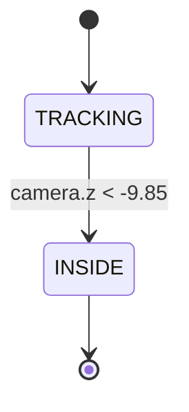

# 04 — Sprint 2: Transição Cinemática (CinematicEvent)

Este documento explica o sistema de câmera que acompanha a velocidade do zoetrópio e realiza a transição para a cena 3D.

---

## 1. Conceito

A câmera é **diretamente vinculada** à velocidade do zoetrópio:
- Velocidade 0% → câmera na posição inicial (lateral, observando a sala)
- Velocidade 95% → câmera atrás da parede (dentro da nova cena)

Não existe botão ou trigger discreto — a transição é **contínua e reversível** (até o ponto de não-retorno).

```
Velocidade:  0% ─────── 30% ─────── 70% ─────── 95% ──── 100%
                                                    │
Câmera:     [LATERAL]   [quase parada]   [se move]  [DENTRO]
                         ↑ smoothstep    ↑ rápido     │
                         ease-in         ease-out     ▼
                                                  LOCKED
```

---

## 2. Matemática: Mapeamento Velocidade → Posição

### 2.1 Normalização da Velocidade

$$t_{raw} = \frac{v_{atual}}{v_{max} \times 0.95}$$

Dividimos por $0.95 \times v_{max}$ (não por $v_{max}$) porque com LERP exponencial (fator 0.05), a velocidade **nunca atinge** exatamente o máximo — ela converge assintoticamente. Em ~60 frames, atinge 95%.

### 2.2 Clamp

$$t_{clamped} = \text{clamp}(t_{raw}, 0, 1)$$

Garante que não extrapolamos além do destino (se speed > 95% do max por algum motivo).

### 2.3 Smoothstep (Easing Hermite)

$$s(t) = 3t^2 - 2t^3$$

```
s(t)
1.0 ┤                          ╭────
    │                       ╭──╯
    │                    ╭──╯
    │                 ╭──╯
    │              ╭──╯
    │           ╭──╯
    │        ╭──╯
0.0 ┤───────╯
    └───────────────────────────────── t
    0                                 1
```

**Efeito prático**:
- $t \in [0, 0.3]$: $s \approx 0$ → câmera quase não se move (o usuário assiste a projeção em paz)
- $t \in [0.3, 0.7]$: $s$ cresce → câmera se aproxima
- $t \in [0.7, 1.0]$: $s \to 1$ → câmera dispara para a posição final (efeito cinematográfico)

### 2.4 LERP da Posição

$$\mathbf{P}(s) = \mathbf{P}_{start} \times (1 - s) + \mathbf{P}_{end} \times s$$

Com:
- $\mathbf{P}_{start} = (8, 5, 6)$ — posição lateral da câmera
- $\mathbf{P}_{end} = (0, 4, -12)$ — 2 unidades atrás da parede

### 2.5 LERP do LookAt

$$\mathbf{L}(s) = \mathbf{L}_{start} \times (1 - s) + \mathbf{L}_{end} \times s$$

Com:
- $\mathbf{L}_{start} = (0, 3, -2)$ — olhando entre zoetrópio e parede
- $\mathbf{L}_{end} = (0, 4, -15)$ — olhando para dentro da cena 3D

Interpolar **posição e target juntos** garante rotação suave (sem saltos angulares).

---

## 3. Estados



### TRACKING (estado principal)

A câmera rastreia a velocidade. É **bidirecional** — se o usuário soltar ↑, a velocidade cai e a câmera volta (até o ponto de não-retorno).

A cada frame:
```
1. speedNorm = zoetrope.getSpeedNormalized()     // [0, 1]
2. t = clamp(speedNorm / 0.95, 0, 1)
3. s = smoothstep(t)
4. camera.position = lerp(START_POS, END_POS, s)
5. camera.lookAt(lerp(LOOK_START, LOOK_END, s))
6. Se camera.z < -9.85 → transição para INSIDE
```

### INSIDE (estado final)

Ponto de não-retorno. Quando a câmera cruza z = -9.85:

1. **Parede escondida**: `wall.visible = false` (evita z-fighting com near plane)
2. **Controles desativados**: `zoetrope.setControlsEnabled(false)`
3. **Câmera fixada**: posição = END_POS, lookAt = LOOK_END
4. **Flag pública**: `this.isInside = true` (Sprint 3 lê para revelar cavalo)

---

## 4. View Matrix e lookAt

`camera.lookAt(target)` reconstrói a **View Matrix** a cada frame:

$$V = \begin{pmatrix} r_x & r_y & r_z & -\mathbf{r} \cdot \mathbf{e} \\ u_x & u_y & u_z & -\mathbf{u} \cdot \mathbf{e} \\ -f_x & -f_y & -f_z & \mathbf{f} \cdot \mathbf{e} \\ 0 & 0 & 0 & 1 \end{pmatrix}$$

Onde:
1. $\mathbf{f} = \text{normalize}(\text{target} - \text{position})$ — forward
2. $\mathbf{r} = \text{normalize}(\mathbf{f} \times \mathbf{up}_{world})$ — right
3. $\mathbf{u} = \mathbf{r} \times \mathbf{f}$ — up (recalculado)
4. $\mathbf{e}$ = posição da câmera

A View Matrix transforma coordenadas mundo → coordenadas câmera (câmera na origem, olhando para -Z).

---

## 5. Por que z = -9.85?

A parede está em $z = -10.05$. O **near plane** da câmera está a 0.1 unidades:

```
       near=0.1
camera ──|──────── parede
  z=-9.85  z=-9.75   z=-10.05
       ↑
     câmera aqui
```

Se a câmera estivesse mais perto da parede que o near plane, a parede desapareceria de qualquer forma (clipping). Escondemos em z=-9.85 para:
1. Evitar **z-fighting** (flickering) quando câmera está quase na superfície
2. Garantir transição limpa antes de qualquer artefato visual

---

## 6. Frustum Culling Natural

Após travessia, a câmera está em $(0, 4, -12)$ olhando para $(0, 4, -15)$:

```
Camera frustum (vista de cima):

                    Near plane
        Sala         │    Cena do Cavalo
  z=0 ─── z=-10 ───│─── z=-15 ───
                    ↑
               z=-12.1 (near = câmera.z - 0.1)
```

A sala inteira (z > -10) fica **atrás** do near plane → automaticamente excluída pelo GPU frustum culling. Não precisa esconder manualmente mesa, chão, zoetrópio, etc.

---

## 7. Constantes

| Constante | Valor | Significado |
|-----------|-------|-------------|
| `SPEED_FULL_TRAVEL` | 0.95 | Fração do max onde câmera completa jornada |
| `START_POS` | (8, 5, 6) | Posição inicial (CameraManager default) |
| `END_POS` | (0, 4, -12) | Posição final (atrás da parede) |
| `LOOK_START` | (0, 3, -2) | Target inicial (vista geral sala) |
| `LOOK_END` | (0, 4, -15) | Target final (centro do cavalo) |
| `WALL_HIDE_Z` | -9.85 | Z de ocultação da parede |

---

## 8. Resumo Visual do Frame

```
Frame N (estado TRACKING):
  1. Lê speedNorm do ZoetropeAnimation
  2. t = speedNorm / 0.95   (normaliza para [0, 1])
  3. t = clamp(t, 0, 1)
  4. s = 3t² - 2t³           (smoothstep)
  5. pos = START + s×(END - START)
  6. look = LOOK_START + s×(LOOK_END - LOOK_START)
  7. camera.position = pos
  8. camera.lookAt(look)
  9. Se pos.z < -9.85:
     - wall.visible = false
     - controls disabled
     - state → INSIDE
     - isInside = true
```
